# Cas pràctic 2

## Índex
* Instalar Apache
* Instalem MariaDB
* Creem la base de dades per Owncloud
* Instalem PHP i tots els moduls necessaris
* Instalem Owncloud


### Instalar Apache
Instalem el servidor Apache amb la seguent comanda:
`sudo apt install apache2`

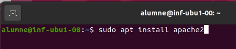

Desactivem el llista de directoris del servidor:
`sudo sed -i "s/Options Indexes FollowSymLinks/Options FollowSymLinks/" /etc/apache2/apache2.conf`

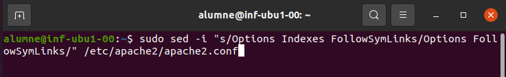

### Instalem MariaDB
Instalem el gestor de bases de dades MariaDB:
`sudo apt-get install mariadb-server mariadb-client -y`

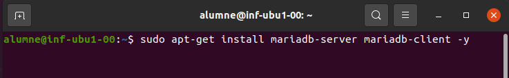

I configurem la nostra instalació

`sudo mysql_secure_installation`

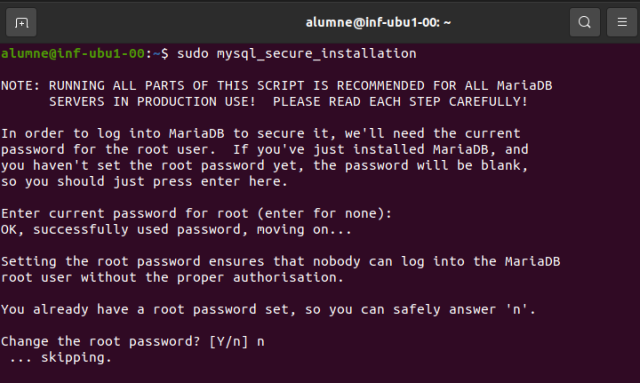

Tot seguit, ens demanarà unes opcións de configuració;
* Change the root password: no
* Remove anonymous users?: y
* Disallow root login remotely?: y
* Remove test databases and acces to it?: y
* Reload privilege tables now?: y

Totes aquestes són opcións de seguretat.

Per ultim reiniciem el servei de MariaDB
`sudo systemctl restart mariadb.service`

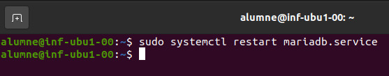

### Creem la base de dades per Owncloud
Entrem a MariaDB

`sudo mysql -u root -p`

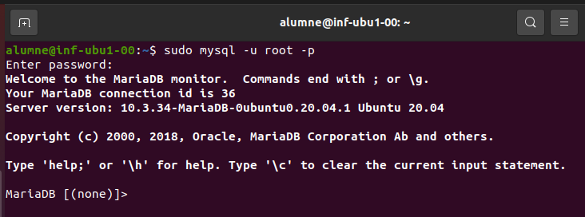

Creem la base de dades

`CREATE DATABASE owncloud;`

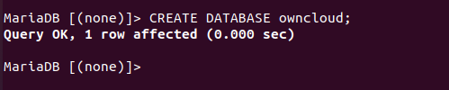

Creem l'usuari "owncloud" amb la seva contrasenya "Admin1234".

`CREATE USER 'ownclouduser'@'localhost' IDENTIFIED BY 'Admin1234';`

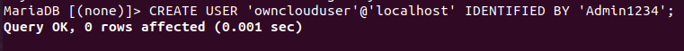

Li donem accés a l'usuari que acabem de crear a la base de dades de owncloud

`GRANT ALL ON owncloud.* TO 'ownclouduser'@'localhost' IDENTIFIED BY 'Admin1234' WITH GRANT OPTION;`

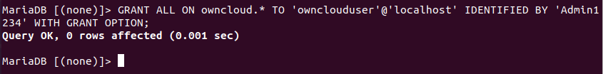

Apliquem els cambis amb  `FLUSH PRIVILEGES;` i `EXIT;` i sortim.

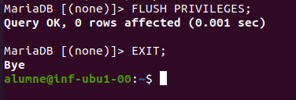

### Instalem PHP i tots els moduls necessaris
`sudo apt-get install software-properties-common -y`

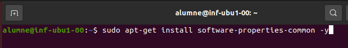

`sudo add-apt-repository ppa:ondrej/php`

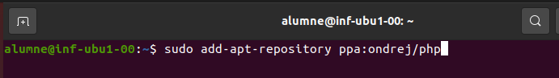

Actualitzem els paquets que acabem d'afegir amb
`sudo apt update`

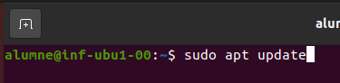

Instalem PHP amb tots els moduls que necessitarem
`sudo apt install php7.4 libapache2-mod-php7.4 php7.4-common php7.4-mbstring php7.4-xmlrpc php7.4-soap php7.4-apcu php7.4-smbclient php7.4-ldap php7.4-redis php7.4-gd php7.4-xml php7.4-intl php7.4-json php7.4-imagick php7.4-mysql php7.4-cli php7.4-mcrypt php7.4-ldap php7.4-zip php7.4-curl -y`

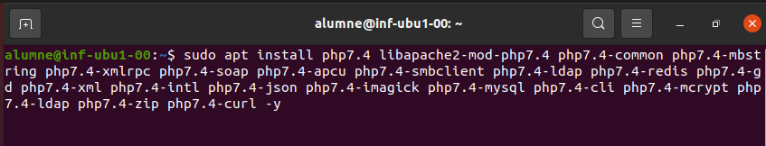

Després de la instalació editem el fitxer php.ini i cambiem alguns dels seus valors
`sudo nano /etc/php/7.4/apache2/php.ini`

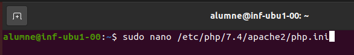

Els valors a cambiar són els seguents:
`file_uploads = On`
`allow_url_fopen = On`
`memory_limit = 256M`
`upload_max_filesize = 100M`
`display_errors = Off`
`date.timezone = Europe/Madrid`

### Instalem Owncloud
Descarregem la ultima versió del programa i descomprimim els fitxers, amés movem aquestos fitxers d'Owncloud a "/var/www/html/owncloud"

`cd /tmp && wget https://download.owncloud.com/server/stable/owncloud-complete-latest.zip`

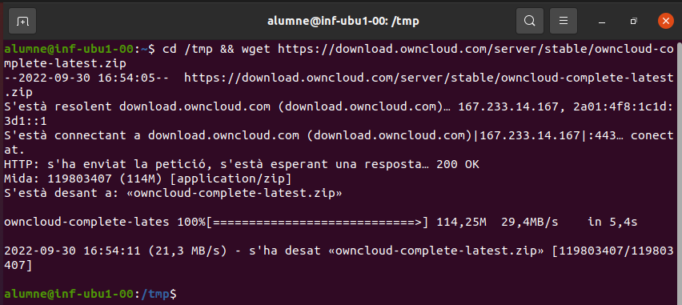

`unzip owncloud-10.0.8.zip`

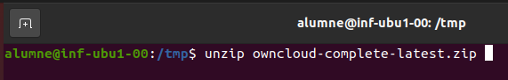

`sudo mv owncloud /var/www/html/owncloud/`

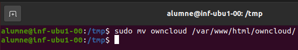

Cambiem el propietari i permís dels directoris d'Owncloud. www-data per a que els pugui utilitzar Apache, 755 para que els puga executar i llegir cualsevol usuari de linux.

`sudo chown -R www-data:www-data /var/www/html/owncloud/`

`sudo chmod -R 755 /var/www/html/owncloud/`

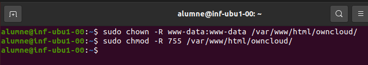


`sudo nano /etc/hosts`
127.0.0.1     owncloud.NRM.com

`sudo nano /etc/apache2/sites-available/owncloud.conf`

copiar info de 

canviar ServerName

canviar ServerAlias
```
<VirtualHost *:80>
    ServerAdmin admin@example.com
    DocumentRoot /var/www/html/owncloud/
    ServerName owncloud.nrm.com
    ServerAlias www.owncloud.nrm.com
    
   Alias /owncloud "/var/www/html/owncloud/"
    
   <Directory /var/www/html/owncloud/>
      Options +FollowSymlinks
      AllowOverride All
      Require all granted
        <IfModule mod_dav.c>
          Dav off
        </IfModule>
      SetEnv HOME /var/www/html/owncloud
      SetEnv HTTP_HOME /var/www/html/owncloud
    </Directory
    
   ErrorLog ${APACHE_LOG_DIR}/error.log
   CustomLog ${APACHE_LOG_DIR}/access.log combined

</VirtualHost>
```


`cd etc/apache2/sites-available`

`sudo a2ensite owncloud.conf`

`service apache2 restart`
