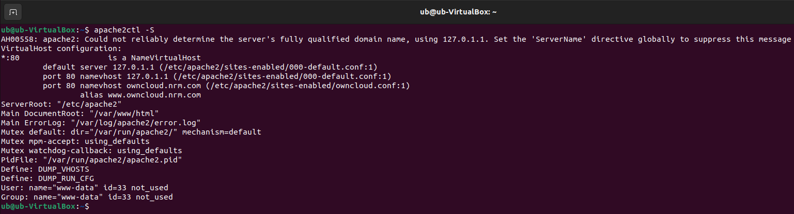
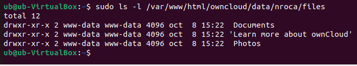
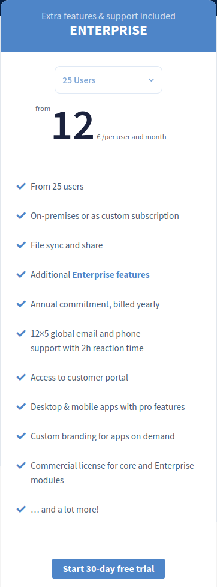
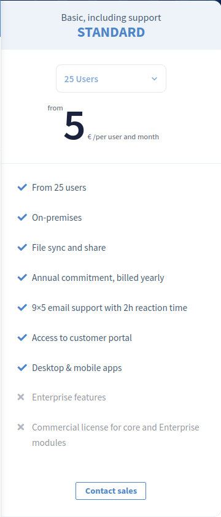
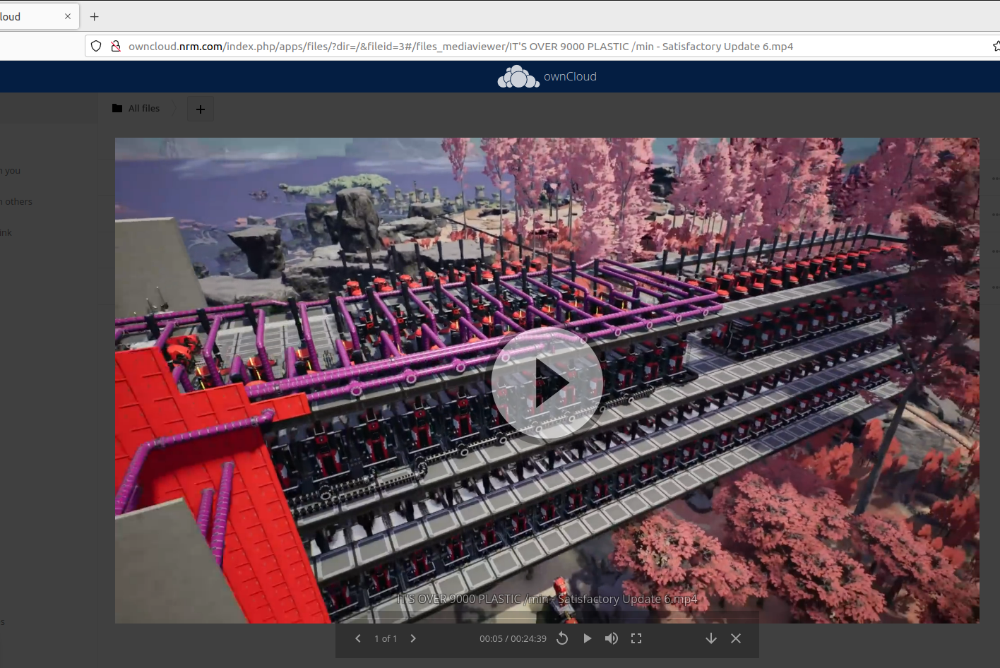
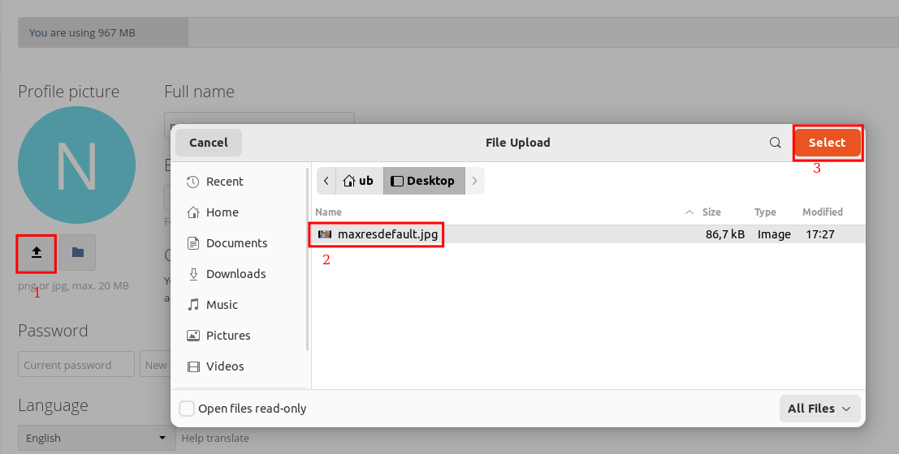
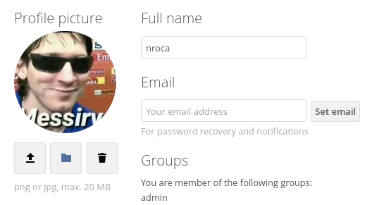

# Cas pràctic 3

### 3.1.- Llista els Virtual Hosts d'Apache per tal de veure si owncloud.XYZ.com està habilitat amb la comanda:

`apache2ctl -S`

**Resposta**

### 3.2.- A Owncloud podem veure que hi ha una serie de carpetes per defecte, mostra la ruta real a les tres carpetes dins de la teva MV.
Les dades de cadascun es troben a `/var/www/html/owncloud/data/(usuari)/files` , en el meu cas és així:

### 3.3.- Al directori Learn more about owncloud hi ha informació en forma de fitxers pdf. Consulta'ls i respon aquestes preguntes:

**Quin són els tres tipus de protecció de dades que ofereix Owncloud?**

1. Encriptació del trafic amb HTTPS i TLS.
2. Encriptació avans de guardar els arxius al servidor, i Encriptació avans de guardar els arxius al servidor amb un HSM (Hardware Security Moudle).
3. Encriptació amb Punt a Punt, (End to End) s'encripta el tràfic i només poden veure el missatge o arxiu el servidor i l'usuari que intenta accedir-hi.

**Fes una petita descripció de cada un d'ells.**

1. Encriptació en el trafic amb HTTPS i TLS.
S'encripta el tràfic entre el sevidor de owncloud i la base de dades, si el servidor d'emmagatzematge es extern, i amb l'usuari. Aixó vol dir que ningú que pugui veure el tràfic d'owncloud, veurà dades encriptades amb HTTPS.

2. Encriptació avans de guardar els arxius al servidor, i amb un HSM (Hardware Security Moudle).
Avans de guardar les dades, missatges o arxius, s'encripten amb una master key.
Alternativament, s'encripten les dades utilitzant un servidor HSM (Hardware Security Module), aquest servidor proveeix la master key per poder encriptar les dades, aixó ens serveix per a que l'administrador de owncloud, o el servidor de dades no puguin llegir les dades dels usuaris.

3. Encriptació amb Punt a Punt, (End to End).
S'encripta el tràfic i només poden veure el missatge o arxiu el servidor i l'usuari que intenta accedir-hi.

**Per quina raó ens recomana utilitzar Owncloud per als documents de Microsoft Office de la nostra empresa?**

Pagant per les extensions de la seva marketplace com, Collabora Online, i OnlyOffice, pots veure i editar els fitxers de office de forma remota.

**Això passa a tots els països?**

Sí

**Quina és la llicència d'Owncloud Enterprise?**

Pagues una mensualitat per usuari, i et dona beneficis:

**I la d'Owncloud Standard?**

Funciona de la mateixa forma que owncloud enterprise pero amb diferents beneficis

**Es poden veure videos en Streaming directament des de Owncloud?**

Si que es poden veure videos:

**Es poden connectar directoris de Google Drive a Owncloud?**

Es pot configurar un accés desde l'emmagatzematge extern.

**I Dropbox?**

Amb extensións del marketplace

**Compta Owncloud amb antivirus? En cas afirmatiu com es diu?**

Necessites instal·lar una aplicació apart.

### 3.4.- Mostra els següents canvis de paràmetres d'usuari:

**Posa't una imatge d'usuari.**

Tenim d'anar a la configuració de owncloud a la part dreta superior de l'usuari i següir aquestos passos:

**Afegeix el teu mail de l'Institut.**
**Canvia l'idioma a català.**
**Mostra la versió d'Owncloud instal·lada.**
