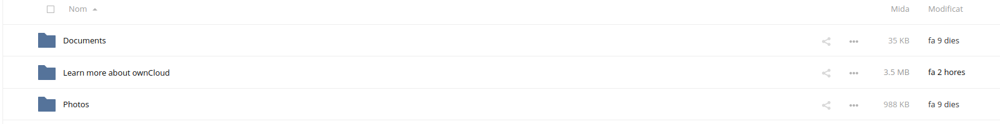
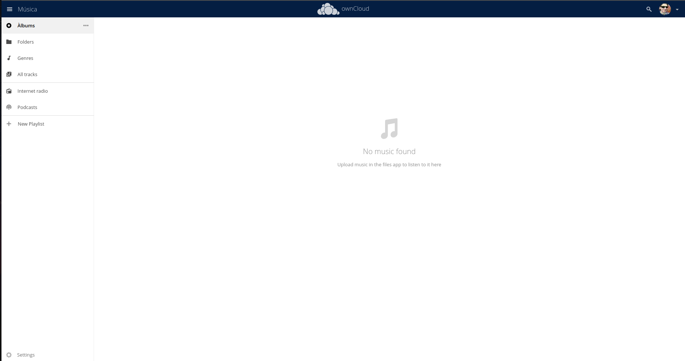

# Cas pràctic 4

### 4.1.- Crea un usuari admin que es digui adminXYZ, on XYZ són les inicials del teu nom:

### 4.2.- Inicia sessió com a l'usuari adminXYZ.

### 4.3.- Crea un usuari XYZ on XYZ son les inicials del company/a i afegeix-lo al grup usuaris, aquest usuari tindrà una quota de 512 MB.

### 4.4.- Podem crear fitxers d'una mida determinada a Linux amb la comanda:
Crea 6 fitxers de 100MB i pujal's a Owncloud un per un.

### 4.5.- Mostra el missatge d'error per haver superat la quota d'usuari.

### 4.6.- Busca al teu perfil quin percentatge de quota estas utilitzant.

### 4.7.- Canvia la quota de l'usuari a 1GB i mostra tots els fitxers pujats.

### 4.8.- Crea un usuari anomenat usuari2XYZ i fical al grup usuaris.

### 4.9.- Comparteix un fitxer de usuariXYZ a usuari2XYZ i mostra com l'usuari2XYZ pot veure i descarregar el fitxer.

### 4.10.- Esborra la carpeta Learn more about owncloud.

### 4.11.- Recupera la carpeta Learn more about owncloud.

### 4.12.- Com a usuariXYZ crea una carpeta nova anomenada shared i comparteix-la amb l'usuari usuari2XYZ.

### 4.13.- Entra a Market instal·la dues aplicacions que no estiguin ja instal·lades i explica què fan i com funcionen.

La primera app és un calendari amb el nom "Calendar" i ens surt com una altra opció del submenú de la part superior esquerra:

La segona app és un reproductor de música a l'estil de iTunes i Groove Music, i a l'igual que el calendari també ens surt com una altra opció del submenú d'aplicacions:

### 4.14.- Crearem una carpeta nova per emmagatzematge a Owncloud, la carpeta serà /media/publicXYZ on XYZ són les teves inicials i apareixerà amb el nom de public als usuaris. Aquesta carpeta haurà de pertànyer a l'usuari www-data.

### 4.15.- Connectarem la carpeta publicXYZ com emmagatzematge local, tal i com s'indica aquí. Tots els usuaris tindran accés a la carpeta.

### 4.16.- Un usuari normal pujarà un fitxer a la carpeta public.

